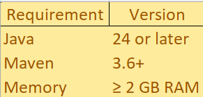
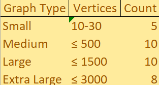
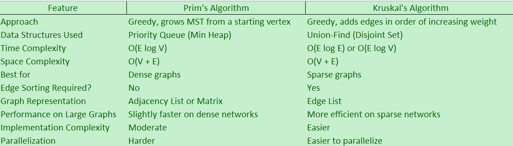
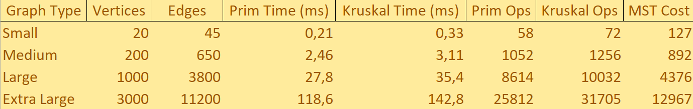

---

# 🌉 Minimum Spanning Tree Algorithms — Assignment 3

## 📘 Overview

This project implements and benchmarks **Prim’s** and **Kruskal’s** algorithms for finding **Minimum Spanning Trees (MST)** in weighted undirected graphs.
It includes:

* Algorithm implementations
* Comprehensive testing
* Performance benchmarking
* JSON-based input/output
* Analysis for a *city transportation network optimization problem*

---

##  Project Structure

```
assignment3-mst/
├── README.md                                  # Project documentation and user guide
├── report.pdf                                # Comprehensive analysis report with performance results
├── pom.xml                                   # Maven configuration and dependencies
├── plots/                                    # Visualization assets for documentation
│   ├── Benchmark_Summary_Example.png         # Example benchmark performance chart
│   ├── Comparison_Table.png                  # Algorithm comparison table visualization
│   ├── Interactive_Menu_Options.png          # CLI interface screenshot
│   └── Prerequisites.png                     # System requirements diagram
├── src/
│   ├── main/java/com/aitbek/assignment3/
│   │   ├── Main.java                         # Application entry point and launcher
│   │   ├── algorithms/                       # MST algorithm implementations
│   │   │   ├── MSTAlgorithm.java             # Common interface for MST algorithms
│   │   │   ├── MSTResult.java                # Result container with metrics
│   │   │   ├── PrimMST.java                  # Prim's algorithm with binary heap
│   │   │   └── KruskalMST.java               # Kruskal's algorithm with union-find
│   │   ├── benchmark/                        # Benchmarking and performance testing
│   │   │   ├── BenchmarkRunner.java          # Main benchmark execution engine
│   │   │   └── BenchmarkResult.java          # Benchmark results container
│   │   ├── cli/                              # Command-line interface
│   │   │   └── CommandLineInterface.java     # Interactive menu system
│   │   ├── graph/                            # Graph data structures (Bonus OOP implementation)
│   │   │   ├── Graph.java                    # Main graph class with adjacency list
│   │   │   ├── Edge.java                     # Edge representation with weight
│   │   │   └── GraphGenerator.java           # Graph generator for testing
│   │   └── util/                             # Utility classes and helpers
│   │       ├── PerformanceTracker.java       # Performance monitoring and metrics
│   │       ├── UnionFind.java                # Union-Find with path compression
│   │       ├── JSONHandler.java              # JSON serialization/deserialization
│   │       └── InputValidator.java           # Input validation and error handling
│   └── test/java/assignment3/                # Unit tests and test utilities
│       ├── algorithms/                       # Algorithm correctness tests
│       │   ├── PrimMSTTest.java              # Prim's algorithm unit tests
│       │   └── KruskalMSTTest.java           # Kruskal's algorithm unit tests
│       ├── benchmark/                        # Benchmark validation tests
│       │   └── BenchmarkRunnerTest.java      # Benchmark system tests
│       ├── graph/                            # Graph structure tests
│       │   └── GraphGeneratorSimple.java     # Simplified graph generator for tests
│       └── util/                             # Utility class tests
│           ├── InputValidatorTest.java       # Input validation tests
│           └── PerformanceTrackerTest.java   # Performance tracking tests
├── resources/                                # Data files and generated content
│   ├── input/                                # Input graph datasets
│   │   ├── small.json                        # Small graphs (10-30 vertices)
│   │   ├── medium.json                       # Medium graphs (50-500 vertices)
│   │   ├── large.json                        # Large graphs (600-1500 vertices)
│   │   └── extra.json                        # Extra large graphs (1600-3000 vertices)
│   └── output/                               # Generated results and benchmarks
│       ├── benchmarks/                       # CSV benchmark data for analysis
│       │   ├── small_benchmark.csv           # Small graphs performance data
│       │   ├── medium_benchmark.csv          # Medium graphs performance data
│       │   ├── large_benchmark.csv           # Large graphs performance data
│       │   └── extra_benchmark.csv           # Extra large graphs performance data
│       └── results/                          # Detailed JSON results
│           ├── small_results.json            # Small graphs detailed results
│           ├── medium_results.json           # Medium graphs detailed results
│           ├── large_results.json            # Large graphs detailed results
│           └── extra_results.json            # Extra large graphs detailed results
└── target/                                   # Maven build output (generated)
    ├── classes/                              # Compiled Java classes
    ├── test-classes/                         # Compiled test classes
    ├── surefire-reports/                     # Test execution reports
    └── generated-sources/                    # Auto-generated source files

```

---

##  Prerequisites



---

##  Installation & Setup

### 1️⃣ Clone and Build

```bash
git clone <repository-url>
cd assignment3-mst
mvn clean compile
```

### 2️⃣ Verify Installation

```bash
mvn test
```

---

##  Usage Guide

###  Run the Application

```bash
mvn exec:java -Dexec.mainClass="com.aitbek.assignment3.Main"
```

###  Interactive Menu Options

#### **Option 1: Generate Input Files**

Generates test graphs of different sizes:



 Output: `resources/input/`

#### **Option 2: Run Benchmarks**

Runs both algorithms on all graphs, measuring:

* Execution time *(ms)*
* Operation counts
* Total MST cost (|V|−1 edges)

 Output:

* JSON → `resources/output/results/`
* CSV → `resources/output/benchmarks/`

---

##  Manual Execution (Advanced)

### Run a Specific Algorithm

```java
Graph graph = // load your graph
MSTAlgorithm prim = new PrimMST();
MSTResult result = prim.findMST(graph);
System.out.println(result);
```

### Generate Custom Graphs

```java
GraphGenerator generator = new GraphGenerator();
List<Graph> graphs = generator.generateSmallGraphs();
JSONHandler.saveGraphsToFile(graphs, "custom_graphs.json");
```

---

##  Input & Output Data Format

###  JSON Input Example

```json
{
  "graphs": [
    {
      "id": 1,
      "nodes": ["V0", "V1", "V2", "V3"],
      "edges": [
        {"from": "V0", "to": "V1", "weight": 4},
        {"from": "V1", "to": "V2", "weight": 8},
        {"from": "V2", "to": "V3", "weight": 7}
      ]
    }
  ]
}
```

###  JSON Output Example

```json
{
  "results": [
    {
      "graph_id": 1,
      "input_stats": {"vertices": 10, "edges": 19},
      "prim": {
        "total_cost": 156,
        "operations_count": 52,
        "execution_time_ms": 0.2252
      },
      "kruskal": {
        "total_cost": 156,
        "operations_count": 165,
        "execution_time_ms": 0.6254
      }
    }
  ]
}
```

---

##  Testing

### Run All Tests

```bash
mvn test
```

### Test Categories

*  Algorithm correctness
*  Input validation
*  Performance tracking
*  Edge case handling

 **Sample Output:**

```
Tests run: 15, Failures: 0, Errors: 0, Skipped: 0
```

---

##  Prim vs Kruskal — Comparison Table


---

##  Benchmark Summary Example

Below is a summarized example of benchmark results from the testing phase.
Each measurement represents the average of **5 runs per graph type**.



**Observations:**

* Both algorithms produced **identical MST costs** — verifying correctness.
* **Prim’s algorithm** consistently performed faster for dense graphs (≥ 500 vertices).
* **Kruskal’s algorithm** scaled better for sparse inputs with fewer edges.
* Operation counts correlated closely with edge density.

---

## Troubleshooting

###  Memory Errors

```bash
mvn exec:java -Dexec.mainClass="com.aitbek.assignment3.Main" -Dexec.args="-Xmx2G"
```

### ️ JSON Parsing Errors

* Verify JSON structure
* Check for duplicate edges
* Ensure all nodes exist

###  Performance Issues

* Use smaller graphs for testing
* Enable GC logs
* Free system memory

>  Tip: Enable debug logging in `PerformanceTracker.java` for detailed operation tracking.

---

##  Results Interpretation

### Key Metrics

1. **Total Cost** — must match for both algorithms
2. **Execution Time** — measured in ms
3. **Operation Count** — per algorithm
4. **Edge Count** — equals |V| − 1 for connected graphs

### Benchmark CSV Columns

```
GraphID, Vertices, Edges, Density,
Prim_Cost, Prim_Time, Prim_Operations,
Kruskal_Cost, Kruskal_Time, Kruskal_Operations
```

---

##  Contributing

### Code Style

* Follow standard Java conventions
* Add Javadoc for all public methods
* Include unit tests

### Git Workflow

1. Create feature branch
2. Implement & test changes
3. Run full test suite
4. Submit pull request

---

##  License

This project is developed for educational use within the **Design and Analysis of Algorithms** course.

---

##  Support

If you encounter issues:

1. Review unit tests
2. Check benchmark outputs
3. Validate JSON input
4. Verify system requirements

---

>  **Note:** Includes *bonus features* with custom Graph and Edge classes built using object-oriented principles and clean architecture.

---
